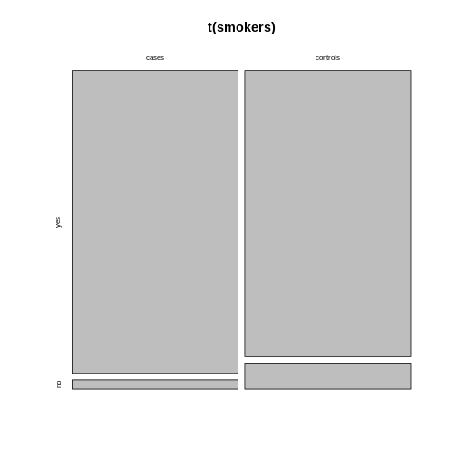

:::::::::::::::::::::::::::::::::::::: questions 

- How can I visualize categorical data in R?

::::::::::::::::::::::::::::::::::::::::::::::::

::::::::::::::::::::::::::::::::::::: objectives

- Learn to make a mosaic plot in base R and using `ggplot2`.

::::::::::::::::::::::::::::::::::::::::::::::::


```r
mytable <- rbind(c(4,96), c(10,90))
rownames(mytable) <- c("not exposed","exposed")
colnames(mytable) <- c("diseased", "healthy")
```


You now know how to calculate a measure for association from your table - great! But so far, we've only looked at numbers, and you've also learned that you should also visualize your data. Yes, even if it's only 4 data points!  


## Using base R

There is a very simple way to do this using base R:


```r
mosaicplot(mytable)
```


The **mosaic plot** consists of rectangles representing the contingency table's cells. The areas of the rectangles are proportional to the respective cells' count, making it easier for the human eye to compare the proportions.

Note that the above mosaicplot is arranged such that the rectangles of one column are neatly stacked on top of each other. At the same time, it has flipped the table such that the rows of our matrix have become the columns and *vice versa*. 

This might not always be how you want your plot to look. For example, consider the smokers example from [the previous episode](../02-effect-size.Rmd):


```r
smokers <- rbind(
  c(688, 650),
  c(21, 59)
)

rownames(smokers) <- c("yes", "no")
colnames(smokers) <- c("cases", "controls")
```

If we apply the `mosaicplot` here, it'll look like this:

```r
mosaicplot(smokers)
```


Using the argument `sort`, you can determine how the rectangles are aligned. You can align them by rows as follows: 

```r
mosaicplot(smokers,
           sort = c(2,1))
```


Alternatively, you can run the plotting function on the *transposed* contingency table: 

```r
mosaicplot(t(smokers))
```



## Using the `ggplot2` 

We recommend using the `tidyverse` for data analysis in general, and in particular `ggplot2` for plotting. The above function is perfect for getting a quick overview on the data. For creating high-quality, customized graphics, `ggplot2` is usually the better choice. 

This gives us a great opportunity to talk about tidy data: In a tidy table 

- each variable is a column and 
- each observation is a row. 

::::::::::: challenge

What would the mice table look like in tidy format? 

::::::::::::: solution
It would have three columns, according to the variables: `exposure` (exposed or not), `outcome` (diseased or healthy), and `count`. 

::::::::::::::::::
::::::::::::::::::

Let's code up the table in tidy format:


```r
mice <- data.frame(
  exposure = c("yes", "yes", "no", "no"),
  outcome = c("diseased", "healthy", "diseased", "healthy"),
  count = c(10, 90, 4, 96)
)

mice
```

```{.output}
  exposure  outcome count
1      yes diseased    10
2      yes  healthy    90
3       no diseased     4
4       no  healthy    96
```

This tidy table can be the input for the `ggplot` function. There are multiple ways and possible designs for mosaic plots using `ggplot2`. We'll demonstrate one here:


```r
library(tidyverse)
mice %>% 
  group_by(exposure) %>% 
  mutate(sumcount = sum(count)) %>% 
  ggplot(aes(x=exposure, y = count, fill=outcome, width=sumcount)) + 
  geom_bar(stat="identity", position = "fill") +
  facet_grid(~exposure, scales = "free_x", space = "free_x")+
  theme_void() 
```


The above code is borrowed from [this post](https://stackoverflow.com/questions/19233365/how-to-create-a-marimekko-mosaic-plot-in-ggplot2).

::::::::::: callout
The argument `width=sumcount` adjusts the width of the bars according to the sum of counts per group (exposed / not exposed). Since both groups have the same size in the above example, it doesn't actually have an effect here. It will make a difference once the groups differ in size.
:::::::::::::::


