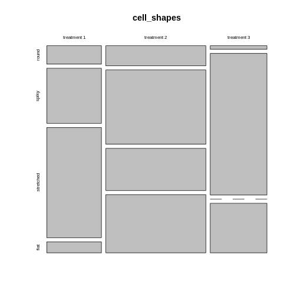

:::::::::::::::::::::::::::::::::::::: questions 

- When are Fisher- and Chisquare test not applicable for biological data?
- What are alternative methods?

::::::::::::::::::::::::::::::::::::::::::::::::

::::::::::::::::::::::::::::::::::::: objectives

- Explain overdispersion and how it can lead to false positives.  
- Explain random effects.
- Name some alternative methods.

::::::::::::::::::::::::::::::::::::::::::::::::


## Overview

The lesson has been using a very simple example to illustrate the principles behind analyzing categorical data. 

Of course, biological data are often more complex than can be captured by a $2\times2$ table. 

Some examples for this are:  

- There are more than two categories per variable. For instance, 3 different treatments are applied on cultured cells, and individual cells are subsequently categorized into 4 mutually exclusive phenotypes. 
- There are more than two variables. For instance, the above experiments could have been carried out in three replicates, such that replicate is the third variable. We are looking for an effect that is consistent across replicates. 


## Larger tables

Let's start with the first example, where 3 different treatments are applied on cultured cells, and individual cells are subsequently categorized into 4 mutually exclusive phenotypes. The resulting contingency table could look like this:


|            | round | spiky | stretched | flat |
|:-----------|:-----:|:-----:|:---------:|:----:|
|treatment 1 |   5   |  15   |    30     |  3   |
|treatment 2 |  10   |  37   |    21     |  29  |
|treatment 3 |   1   |  40   |     0     |  14  |
### How to visualize the proportions?

We can still use mosaic plots to visualize the proportions: 


``` r
cell_shapes <- rbind(c(5,15,30,3), c(10,37,21,29), c(1,40,0,14))
rownames(cell_shapes) <- c("treatment 1","treatment 2", "treatment 3")
colnames(cell_shapes) <- c("round", "spiky", "stretched", "flat")

mosaicplot(cell_shapes)
```



::::::::::::::: challenge
# For the brave
Can you turn the `cell_shapes` table into tidy data, and make a mosaic plot with `ggplot2`?

::::::::::::::::::: solution

The tricky part is data wrangling:

``` r
tidy_shapes <- data.frame(cell_shapes, treatment=c("treatment1", "traetment2","treatment3")) %>% 
  pivot_longer(cols = 1:4,
               names_to = "shape",
               values_to = "count")

tidy_shapes
```

``` output
# A tibble: 12 × 3
   treatment  shape     count
   <chr>      <chr>     <dbl>
 1 treatment1 round         5
 2 treatment1 spiky        15
 3 treatment1 stretched    30
 4 treatment1 flat          3
 5 traetment2 round        10
 6 traetment2 spiky        37
 7 traetment2 stretched    21
 8 traetment2 flat         29
 9 treatment3 round         1
10 treatment3 spiky        40
11 treatment3 stretched     0
12 treatment3 flat         14
```

For plotting, all you need to do is exchange the variable names from the instructions in [episode 3](../03-visualization.Rmd#using-ggplot2):

``` r
tidy_shapes %>% 
  group_by(treatment) %>% 
  mutate(sumcount = sum(count)) %>% 
  ggplot(aes(x=treatment, y = count, fill=shape, width=sumcount)) + 
  geom_bar(stat="identity", position = "fill") +
  facet_grid(~treatment, scales = "free_x", space = "free_x")+
  theme_void() 
```


Looks much nicer, doesn't it?

::::::::::::::::::::::::::

:::::::::::::::::::::

### What are suitable measures for association?

All the [measures](../02-effect-size.Rmd) you learned about are require a $2\times2$ table. The good news is that you can subset or summarize your $4\times3$ table into smaller tables and calculate odds ratios or differences in proportions on them.

For example, you could compare treatment 2 and 3 with regards to the ratio of flat and round cells. For this, you **subset** the table to the relevant rows and columns:


``` r
shapes_subset <- cell_shapes[2:3,c(1,4)]
shapes_subset
```

``` output
            round flat
treatment 2    10   29
treatment 3     1   14
```

The odds for being round (vs. flat) in treatment 2 compared to treatment 3 are:

``` r
(10/29)/(1/14)
```

``` output
[1] 4.827586
```

If you are rather interested in the overall proportion of round cells, still comparing treatment 2 and 3, you can **subset** the columns and **summarize** some of the rows:


``` r
round <- cell_shapes[2:3,1,drop=FALSE]
others <- cell_shapes[2:3,2:4,drop=FALSE] %>% rowSums

shapes_summary <- cbind(round,others)
shapes_summary
```

``` output
            round others
treatment 2    10     87
treatment 3     1     54
```

Now you can compare the proportions of round cells between the treatments 2 and 3:

``` r
(10/(10+87)) / (1/(1+54))
```

``` output
[1] 5.670103
```
The proportion of round cells is 5 times higher in the experiment with treatment 2.


:::::::::::::::: callout
You probably noticed that with larger tables, you have many more options of sub-setting or summarizing them into $2\times2$ tables. Think carefully about your research question and then decide which comparison you'd like to make.
:::::::::::::::::::::::

### How to calculate significance?

As soon as you have subset or summarized your larger table into a $2\times2$ one, you can apply the standard Fisher or $\chi^2$ test on it, and we'll come back to this very soon.

But luckily, Fisher's exact test and the $\chi^2$ test can also be applied to 2D tables with more than two categories in each dimension, and this should actually be the first step in your hypothesis testing workflow.

A Fisher test on the above $3\times 4$ table will answer the following question: **Is there a difference in phenotype composition between the three treatments?**

This is an overall question and it's controlling for the family-wise error rate. If this test comes out significant, it tells you that under the assumption that phenotype and treatment are not associated in any way (i.e. for each phenotype, the underlying proportion doesn't vary between treatments), your results are very unlikely. 

For the above example, the $\chi^2$ test is clearly significant:

``` r
chisq.test(cell_shapes)
```

``` warning
Warning in chisq.test(cell_shapes): Chi-squared approximation may be incorrect
```

``` output

	Pearson's Chi-squared test

data:  cell_shapes
X-squared = 62.024, df = 6, p-value = 1.744e-11
```

Now you could do follow-up tests in order to find out which phenotypes are different in their proportions between treatments, for example:


``` r
fisher.test(shapes_summary)
```

``` output

	Fisher's Exact Test for Count Data

data:  shapes_summary
p-value = 0.05797
alternative hypothesis: true odds ratio is not equal to 1
95 percent confidence interval:
   0.8335549 273.9339822
sample estimates:
odds ratio 
  6.154128 
```

Just as for calculating measures of association, you should ask yourself what information you're after, before running 10 or more individual comparisons.

## 3D tables

For higher-dimensional tables, life gets yet a bit more complicated. Again, there are different ways of analyzing them, dependent on your research question. We'll look at two examples.

### Conditional independence

Let's assume we have a reduced version of the above experiment, where control and treatment are compared with respect to the number of cells that are "round" or "not round". 

A resulting table might look like this:

|     | round | other |
|:----|:-----:|:-----:|
|ctrl |  16   |  39   |
|trt  |  21   |  42   |

This still looks familiar. But now, the biologist at work was concerned about the reproducibiliy of the experiment, so she performed it twice. And as a result, we look at a 3-dimensional table:


Table: replicate 1

|     | round | other |
|:----|:-----:|:-----:|
|ctrl |  16   |  39   |
|trt  |  21   |  42   |


Table: replicate 2

|     | round | other |
|:----|:-----:|:-----:|
|ctrl |  35   |  89   |
|trt  |  51   |  99   |

#### How to create a 3-D table in R

For analyzing this data, we need to code it up. In R, this can be done as follows.


``` r
rep1 <- rbind(c(16, 39), c(21,42))
rep2 <- rbind(c(35, 89), c(51,99))

table3d <- array(c(rep1, rep2), dim = c(2,2,2))
table3d
```

``` output
, , 1

     [,1] [,2]
[1,]   16   39
[2,]   21   42

, , 2

     [,1] [,2]
[1,]   35   89
[2,]   51   99
```


::::::::: challenge
## Discussion
We could easily bring the above scenario down to a classical $2\times2$ table by pooling the counts across replicates. 
What could be problematic about this approach?

:::::::::::: solution
The replicate might have an effect on the row and column sums. Have a look at the Simpson's paradox.
:::::::::::::::::::
::::::::::::::::::


:::::::::::::: challenge
# Let's try it
Use the above code for creating an array and sum up the counts across replicates.

:::::::::::::::: solution

``` r
rowSums(table3d, dims=2)
```

``` output
     [,1] [,2]
[1,]   51  128
[2,]   72  141
```

:::::::::::::::

:::::::::::::::::::::

To avoid the danger of replicate that are confounded with a variable of interest, one can stratify by replicate. Stratify means: split the analysis by replicate, and then combine the results. 
 
This is what the *Cochran-Mantel-Haenszel test* does. It calculates

- a *common odds ratio* and 
- a modified chi-square, 

taking the replicates into account.


## Three-way interactions 

Refer to Poisson models


## Additional variance

When we're using Fisher's or $\chi^2$ test, we model the data as having been obtained from a particular sampling scheme, like Poisson, binomial or multinomial sampling. These assume that there is an underlying rate, or probability, at which events occur, and which doesn't vary.
For example, we could say that patients show up at a hospital at an average rate of 16 patients per day ($\lambda=16$), and if we took 5 samples at 5 different days, we'd assume the same Poisson rate for each day. The counts would vary from day to day, but with a variance of $var=\lambda$, which is the expected randomness for a Poisson counting process. See also [the lesson on distributions](https://sarahkaspar.github.io/biostatistics-course/05-Poisson.html).

The problem is, that in biology, we often have experiments where we deal with additional variance that can't be explained by the normal variance that's inherent to Poisson counting. 
For example, if we model read counts from RNA sequencing, it turns out that the (residual) variance is much higher than $\lambda$, because the expression of a particular gene usually depends on more factors than just the experimentally controlled condition(s). It is also influenced by additional biological and possibly technical variance, such that the counts vary considerably between replicates.  

### So what?

What happens if we still analyze these data with methods that assume Poisson variance?
This increases the risk for false positives. Intuitively speaking, the increased variance can produce high counts in one or more of the cells, leading to higher proportions than would be expected by change under the assumption of independence and Poisson sampling. So the Fisher test can mistake noise for a difference in proportions.

### What to do?

First of all, think about the data that you're looking at, and how they were produced. If you have several replicates, you have a chance to estimate the variance in your data. In a typical $2\times2$ table, you just have one count per cell, and a different condition in each cell, so there is no chance to infer the variance from looking at the data. In this case you have to ask yourself, whether it's likely that you're overlooking additional variance, and be aware that the data might not perfectly match the assumptions of your test, so don't over-interpret the p-value that you get -- which is always a good advice.

If you do have several counts per condition, you can consider to model your data using a generalized linear model of the negative binomial family. This is outside the scope of this lesson.

