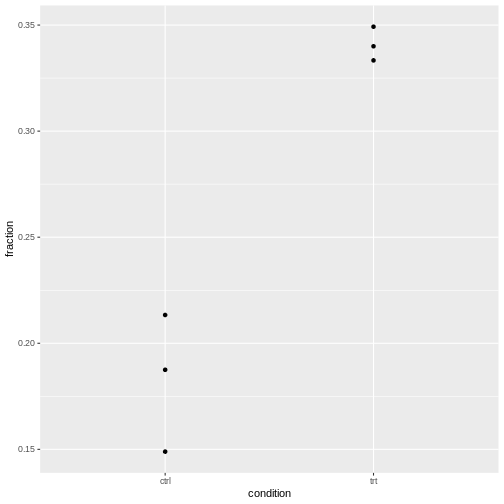

:::::::::::::::::::::::::::::::::::::: questions 

- What is a generalized linear model (GLM) and how can count data be represented with it?
- How can tests for association be implemented with GLMs? 
- How can GLMs help to account for biological variance? 

::::::::::::::::::::::::::::::::::::::::::::::::

::::::::::::::::::::::::::::::::::::: objectives

- Provide a workflow for modeling count data with replicates.

::::::::::::::::::::::::::::::::::::::::::::::::


**NOTE: This episode is work in progress.**

# How to model fractions
Let's consider the example from the previous lesson, and focus on the fractions of round cells in the control group only.


Remember that our `data.frame` with the counts looks like this:

``` r
tidy_table
```

``` output
   replicate condition     shape count
1          1      ctrl     round     9
2          1      ctrl stretched    39
3          1       trt     round    21
4          1       trt stretched    42
5          2      ctrl     round    16
6          2      ctrl stretched    59
7          2       trt     round    51
8          2       trt stretched    99
9          3      ctrl     round     7
10         3      ctrl stretched    40
11         3       trt     round    22
12         3       trt stretched    41
```


``` output
, , 1

     [,1] [,2]
[1,]    9   39
[2,]   21   42

, , 2

     [,1] [,2]
[1,]   16   59
[2,]   51   99

, , 3

     [,1] [,2]
[1,]    7   40
[2,]   22   41
```


We combine the counts from each replicate to calculate totals and observed fractions:

``` r
tidy_data <- tidy_table %>% 
  pivot_wider(
    names_from = shape,
    values_from = count
  ) %>% 
  mutate(total = round + stretched) %>% 
  mutate(fraction = round/total)

tidy_data
```

``` output
# A tibble: 6 × 6
  replicate condition round stretched total fraction
  <chr>     <chr>     <dbl>     <dbl> <dbl>    <dbl>
1 1         ctrl          9        39    48    0.188
2 1         trt          21        42    63    0.333
3 2         ctrl         16        59    75    0.213
4 2         trt          51        99   150    0.34 
5 3         ctrl          7        40    47    0.149
6 3         trt          22        41    63    0.349
```

Then can extract the `ctrl` counts only:

``` r
ctrl_data <- tidy_data %>% 
  filter(condition == "ctrl") 
ctrl_data
```

``` output
# A tibble: 3 × 6
  replicate condition round stretched total fraction
  <chr>     <chr>     <dbl>     <dbl> <dbl>    <dbl>
1 1         ctrl          9        39    48    0.188
2 2         ctrl         16        59    75    0.213
3 3         ctrl          7        40    47    0.149
```

We can model the fraction with a GLM of the binomial family:


``` r
glm.binom <- glm(cbind(round,stretched) ~ 1 , 
      data= ctrl_data,
      family= binomial("logit"))
coefficients(glm.binom)
```

``` output
(Intercept) 
  -1.461518 
```

**Model formula:** This GLM models fractions as a function of the variables we supply behind the `~` sign in the model formula. In our case, we didn't give any variables, just an intercept (denoted by `1`). The intercept therefore represents the fraction of round cells estimated from the data. 

**Logit link:** Linear models assume that data are Gaussian distributed around their predictions. For fractional data, this is not the case. For this reason, the prediction happens on a *logit*-transformed level. We model 

$$\mu = \text{logit}(X\beta)$$,

where $\mu$ is the predicted count, and $X\beta$ is the *linear predictor*, a linear combination of the variables $X$ and the coefficients $\beta$ (including the intercept). 

If all this doesn't sound familiar to you, the important bit is that the coefficients that the GLM of a binomial family returns to us need to be *transformed* in order to be interpretable. 

The logit of a probability $p$ is given by $\ln(\frac{p}{1-p})$. It's also called the *log odds*.

The transformation from a value $x$ on the logit scale to fractions is:

$$\text{fraction} = \frac{\exp(x)}{1 + \exp(x)}$$
Let's transform our intercept into a fraction:


``` r
x <- coefficients(glm.binom)
exp(x)/(1+exp(x))
```

``` output
(Intercept) 
  0.1882353 
```

We can compare this fraction with what we get by calculating a fraction from pooled counts:

``` r
sum(ctrl_data$round) / sum(ctrl_data$total)
```

``` output
[1] 0.1882353
```


We learn: The GLM of the binomial offers an alternative way to calculate fractions. 

# How to model odds ratios

Models are good for determining how observations depend on variables. Observations in our case are fractions, and a meaningful variable can be the treatment. We can add it in the model formula as shown below. We use the full data set, not the one filtered for control data only.


``` r
glm.binom.1var <- glm(cbind(round,stretched) ~ condition , 
      data= tidy_data,
      family= binomial("logit"))
```

This model gives us two coefficients: 

``` r
coefficients(glm.binom.1var)
```

``` output
 (Intercept) conditiontrt 
  -1.4615178    0.8008059 
```

`Intercept` is the logit-transformed fraction (log odds) of round cells in the reference state, which is the `ctrl` group. By default, R sets the reference state by alphabetical order, and `ctrl` is before `trt`.  
`conditiontrt` is the coefficient which describes how the log odds for being round *change* when the condition is `trt` instead of `ctrl`. 

We can combine the two coefficients in the linear predictor $X\beta$ to calculate the fraction for treated cells.


``` r
xb <- sum(coefficients(glm.binom.1var))
exp(xb)/(1+exp(xb))
```

``` output
[1] 0.3405797
```

Let's compare to the pooled fraction of round cells in the treatment condition:


``` r
trt_data <- tidy_data %>% filter(condition == "trt")
sum(trt_data$round) / sum(trt_data$total)
```

``` output
[1] 0.3405797
```

The `conditiontrt` coefficient can also be interpreted as a log odds ratio. We can calculate the observed log odds ratio on pooled data, which is given by

$\log(\frac{n_{11} n_{22}}{n_{12}n_{21}})$.

Here is the estimate from the data:

``` r
observed_odds_ratio <- sum(ctrl_data$round) * sum(trt_data$stretched) / (sum(ctrl_data$stretched)* sum(trt_data$round))

observed_log_odds <- log(observed_odds_ratio)

observed_log_odds
```

``` output
[1] -0.8008059
```

It coincides with the `conditiontrt` coefficient with a flipped sign:

``` r
coefficients(glm.binom.1var)[2]
```

``` output
conditiontrt 
   0.8008059 
```

If you exchange the first and second column of the table (or the first and second row), the log odds ratio will also flip sign.

### Mathematical explanation

We know that 

- the coefficient `Intercept` gives the log odds for being round in the control condition: $\text{Int}=\text{log odds}_{ctrl}$ 
- the sum of the coefficients `conditiontrt` and `Intercept` give the log odds ratio for being round in the treatment condition: $\text{Intercept}+ \text{conditiontrt} = \text{log odds}_{trt}$

Therefore the coefficient `conditiontrt` can be expressed as 

$$\text{conditiontrt} = \text{log odds}_{ctrl} - \text{log odds}_{trt} = log(\frac{odds_{ctrl}}{odds_{trt}})$$
We learn that GLMs of the binomial family allow us to estimate odds ratios.

### Connection to Chi-square / Fisher test

Set up pooled table:

``` r
pooled_table <- rbind(
  c(sum(ctrl_data$round) , sum(ctrl_data$stretched)),
    c(sum(trt_data$round) ,sum(trt_data$stretched))
)
pooled_table
```

``` output
     [,1] [,2]
[1,]   32  138
[2,]   94  182
```


``` r
chisq.test(pooled_table, correct = FALSE)
```

``` output

	Pearson's Chi-squared test

data:  pooled_table
X-squared = 12.046, df = 1, p-value = 0.0005192
```


``` r
null_model <- glm(cbind(round,stretched) ~ 1 , 
      data= tidy_data,
      family= binomial("logit"))
```


``` r
anova(null_model, glm.binom.1var, test = "Rao")
```

``` output
Analysis of Deviance Table

Model 1: cbind(round, stretched) ~ 1
Model 2: cbind(round, stretched) ~ condition
  Resid. Df Resid. Dev Df Deviance    Rao  Pr(>Chi)    
1         5     13.349                                 
2         4      0.839  1    12.51 12.046 0.0005192 ***
---
Signif. codes:  0 '***' 0.001 '**' 0.01 '*' 0.05 '.' 0.1 ' ' 1
```


**Conclusion**: A chi-square test is a special case of a GLM. 
Testing for the parameter `conditiontrt`, which tells us how different the fractions for control and treatment are, is the same as testing for association of the variables condition and morphology.

(See also [here](https://lindeloev.github.io/tests-as-linear/#7_proportions:_chi-square_is_a_log-linear_model) how to reproduce the result of a chi-square test with a GLM of the poisson family.)


# How to add replicates 

Let's add the replicates to the model:


``` r
glm.binom.repl <- glm(cbind(round,stretched) ~ condition + replicate , 
      data= tidy_data,
      family= binomial("logit")
)

summary(glm.binom.repl)
```

``` output

Call:
glm(formula = cbind(round, stretched) ~ condition + replicate, 
    family = binomial("logit"), data = tidy_data)

Coefficients:
             Estimate Std. Error z value Pr(>|z|)    
(Intercept)  -1.47922    0.26630  -5.555 2.78e-08 ***
conditiontrt  0.79276    0.23468   3.378  0.00073 ***
replicate2    0.06314    0.26300   0.240  0.81027    
replicate3   -0.03887    0.30841  -0.126  0.89972    
---
Signif. codes:  0 '***' 0.001 '**' 0.01 '*' 0.05 '.' 0.1 ' ' 1

(Dispersion parameter for binomial family taken to be 1)

    Null deviance: 13.3492  on 5  degrees of freedom
Residual deviance:  0.6751  on 2  degrees of freedom
AIC: 34.903

Number of Fisher Scoring iterations: 3
```
This model estimates the fractions for each replicate separately.
It say that the effect of the treatment is identical for all replicates (i.e. assumes homogeneous association), and calculates a separate effect of the replicate.

We can compare to the model that only considers the impact of the replicate on the fraction of round cells, but not of the condition. 


``` r
glm.repOnly <- glm(cbind(round,stretched) ~ replicate , 
      data= tidy_data,
      family= binomial("logit")
)
```


``` r
anova(glm.repOnly, glm.binom.repl, test = "Rao")
```

``` output
Analysis of Deviance Table

Model 1: cbind(round, stretched) ~ replicate
Model 2: cbind(round, stretched) ~ condition + replicate
  Resid. Df Resid. Dev Df Deviance    Rao  Pr(>Chi)    
1         3    12.8144                                 
2         2     0.6751  1   12.139 11.703 0.0006239 ***
---
Signif. codes:  0 '***' 0.001 '**' 0.01 '*' 0.05 '.' 0.1 ' ' 1
```

And we can compare to the Cochran-Mantel-Haenszel test.

``` r
mantelhaen.test(table3d)
```

``` output

	Mantel-Haenszel chi-squared test with continuity correction

data:  table3d
Mantel-Haenszel X-squared = 10.895, df = 1, p-value = 0.000964
alternative hypothesis: true common odds ratio is not equal to 1
95 percent confidence interval:
 0.2869095 0.7185351
sample estimates:
common odds ratio 
        0.4540424 
```

We've seen three methods to answer the same question: Does the condition have an impact on the fraction of round cells, when controlling for the effect of the replicate (and assuming the replicate doesn't have alter the effect of the condition)?  

- Use a Wald test for the `conditiontrt` coefficient, given by `summary(glm.binom.repl)`. It yields a p-value of $~0.0007$. 
- Compare the models with the formulae `~replicate` (`glm.repOnly`) and `~condition + replicate` (`glm.repl`) using the `anova` function. This yields a p-value of $~0.0006$. 
- Use the Cochran-Mantel-Haenszel test, which gives a p.value of $~0.0009$. 

We see that the methods are not identical, but give extremely similar results and lead to the same conclusion: When controlling for the replicate (stratifying the analysis), we seen a clear effect of the condition on the fraction of round cells.


## Three-way interaction

If the model `glm.binom.repl` doesn't fit well, this is evidence that the replicate has an impact on the effect of the treatment.
Finally, we really need the GLM, because there is no off-the-shelf test that we can apply to test for three-way interaction.

A model with three-way interaction looks like this:

``` r
glm.threeway <- glm(cbind(round,stretched) ~ condition * replicate , 
      data= tidy_data,
      family= binomial("logit")
)
summary(glm.threeway)
```

``` output

Call:
glm(formula = cbind(round, stretched) ~ condition * replicate, 
    family = binomial("logit"), data = tidy_data)

Coefficients:
                        Estimate Std. Error z value Pr(>|z|)    
(Intercept)              -1.4663     0.3698  -3.965 7.33e-05 ***
conditiontrt              0.7732     0.4563   1.695   0.0902 .  
replicate2                0.1614     0.4650   0.347   0.7285    
replicate3               -0.2766     0.5519  -0.501   0.6162    
conditiontrt:replicate2  -0.1315     0.5633  -0.233   0.8154    
conditiontrt:replicate3   0.3472     0.6677   0.520   0.6030    
---
Signif. codes:  0 '***' 0.001 '**' 0.01 '*' 0.05 '.' 0.1 ' ' 1

(Dispersion parameter for binomial family taken to be 1)

    Null deviance:  1.3349e+01  on 5  degrees of freedom
Residual deviance: -7.7716e-15  on 0  degrees of freedom
AIC: 38.228

Number of Fisher Scoring iterations: 3
```

We see no evidence that the replicate has an impact on the odds ratio, because the coefficients `conditionttrt:replicate2` and `conditiontrt:replicate3` are not significant.


# How to check for overdispersion

We have three replicates, so for each condition, we have three observed fractions of round cells. 

Let's visualize this: 


``` r
tidy_data %>% 
  ggplot(aes(x=condition, y=fraction))+
  geom_point()
```


It's normal that for lower counts, the fractions are jumping around more.
For eyeballing purposes, it's therefore recommended to use stacked bar plots.


The question is whether the counts vary more than expected by a binomial model.

### Intuitive approach

- Compare expected to observed variance and calculate a ratio of these 
- don't over-interpret, because we calculate this from 3 replicates only 
- show exemplary for control


*To be added*: Source, or theory for this?

### Determine overdispersion through model

Take the model without the replicate and check for overdispersion:


``` r
library(performance)
check_overdispersion(glm.binom.1var)
```

``` error
Error: Package `DHARMa` required for this function to work.
  Please install it by running `install.packages("DHARMa")`.
```
Or the one with the replicate included:

``` r
check_overdispersion(glm.binom.repl)
```

``` error
Error: Package `DHARMa` required for this function to work.
  Please install it by running `install.packages("DHARMa")`.
```
For our cell data, we are fine. 
