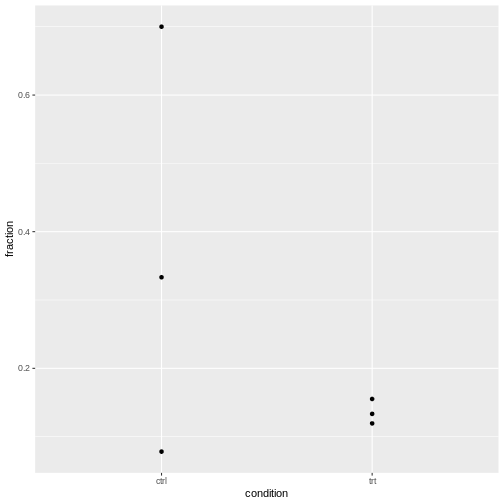

:::::::::::::::::::::::::::::::::::::: questions 

- Which models account for biological variability? 

::::::::::::::::::::::::::::::::::::::::::::::::

::::::::::::::::::::::::::::::::::::: objectives

- Provide a workflow for modeling count additional variability

::::::::::::::::::::::::::::::::::::::::::::::::

**NOTE: This episode is work in progress.**


For the theory in this section, see [this study](https://peerj.com/articles/1114/). 

# The data for this episode

I simulate data that has the same structure and covariates as in the last episode, but different counts: 

- Again, we have `round` and `stretched` as possible cell shapes. 
- We compare the fraction of round and stretched in a control and treatment `condition`. 
- There are three replicates of the resulting $2\times 2$ table. 
- I simulate negative binomial cell counts where 
  - the probability of a cell being round is constant $p=1/3$ in all replicates and conditions. 
  - I.e.: Neither treatment nor replicate have an effect. 
  
In biological terms, imagine we have new data of the same type, but unlike last time,  replicates are now taken on different days by three different technicians.

:::::::::::::::: challenge
# data generation

::::::::: solution
# click to expand

``` r
set.seed(4)
mysize <- 2
ctrl_round <- rnbinom(3,size =mysize , mu = 10)
ctrl_stretched <- rnbinom(3, size = mysize, mu=20)

trt_round <- rnbinom(3, size = mysize, mu= 10)
trt_stretched <- rnbinom(3, size=mysize, mu=20)

cells2 <- data.frame(
  condition = c(rep("ctrl",6), rep("trt",6)),
  shape = rep(c(rep("round",3), rep("stretched",3)),2),
  count = c(ctrl_round, ctrl_stretched, trt_round, trt_stretched),
  replicate = rep(c("1","2","3"),4)
)
```

::::::::::::::::::
::::::::::::::::::

This is what the data looks like.

``` r
cells2
```

``` output
   condition     shape count replicate
1       ctrl     round     7         1
2       ctrl     round     5         2
3       ctrl     round    11         3
4       ctrl stretched     3         1
5       ctrl stretched    59         2
6       ctrl stretched    22         3
7        trt     round     9         1
8        trt     round     8         2
9        trt     round     4         3
10       trt stretched    49         1
11       trt stretched    59         2
12       trt stretched    26         3
```

We bring the data in a suitable format:

``` r
cells2F <- cells2 %>% 
  pivot_wider(
    names_from = "shape",
    values_from = "count"
  ) %>% 
  mutate(total = round + stretched) %>% 
  mutate(fraction = round/total)

cells2F$replicate <- factor(cells2F$replicate)

cells2F
```

``` output
# A tibble: 6 × 6
  condition replicate round stretched total fraction
  <chr>     <fct>     <dbl>     <dbl> <dbl>    <dbl>
1 ctrl      1             7         3    10   0.7   
2 ctrl      2             5        59    64   0.0781
3 ctrl      3            11        22    33   0.333 
4 trt       1             9        49    58   0.155 
5 trt       2             8        59    67   0.119 
6 trt       3             4        26    30   0.133 
```

We add a variable called `obs` for "observation". Each fraction of round cells is an observation in this experiment. We'll need this variable for modeling variability.

``` r
cells2F <- cells2F %>% 
  mutate(obs = factor(1:n()))

cells2F
```

``` output
# A tibble: 6 × 7
  condition replicate round stretched total fraction obs  
  <chr>     <fct>     <dbl>     <dbl> <dbl>    <dbl> <fct>
1 ctrl      1             7         3    10   0.7    1    
2 ctrl      2             5        59    64   0.0781 2    
3 ctrl      3            11        22    33   0.333  3    
4 trt       1             9        49    58   0.155  4    
5 trt       2             8        59    67   0.119  5    
6 trt       3             4        26    30   0.133  6    
```

## Binomial model

Start by setting up a model as in last episode:


``` r
binomial.model <- glm( cbind(round,stretched) ~ condition + replicate , 
      data= cells2F,
      family= binomial("logit")
)

summary(binomial.model)
```

``` output

Call:
glm(formula = cbind(round, stretched) ~ condition + replicate, 
    family = binomial("logit"), data = cells2F)

Coefficients:
             Estimate Std. Error z value Pr(>|z|)   
(Intercept)   -0.4504     0.4182  -1.077  0.28151   
conditiontrt  -0.8821     0.3770  -2.340  0.01930 * 
replicate2    -1.3813     0.4481  -3.083  0.00205 **
replicate3    -0.3438     0.4491  -0.765  0.44401   
---
Signif. codes:  0 '***' 0.001 '**' 0.01 '*' 0.05 '.' 0.1 ' ' 1

(Dispersion parameter for binomial family taken to be 1)

    Null deviance: 25.212  on 5  degrees of freedom
Residual deviance: 10.495  on 2  degrees of freedom
AIC: 39.205

Number of Fisher Scoring iterations: 4
```

Model assumptions: 

- This model allows the fraction to vary by replicate
- We assume the replicate doesn't change how the condition impacts the fractions (otherwise there would be an interaction between `replicate` and `condition`). 
- We don't assume variability on the observation level that goes beyond binomial variability. 

Model finding: 

- According to `binomial.model`, the fractions are significantly different for control and treatment (in each replicate). The Wald test for `conditiontrt` gives $p = 0.019$.


We can now check for overdispersion, based on this model:


``` r
library(performance)
check_overdispersion(binomial.model)
```

``` error
Error: Package `DHARMa` required for this function to work.
  Please install it by running `install.packages("DHARMa")`.
```

This test doesn't find sufficient evidence for overdispersion -- which doesn't mean it's not present. Overdispersion in this case means that on top of the between-replicate variability, the fractions vary on the observation level. It is hard to detect, because a lot of the variability will be attributed to the `replicate` variable in the model.     


We can check visually:

``` r
cells2F %>% 
  ggplot(aes(x=condition, y=fraction))+
  geom_point()
```



We should account for the overdispersion, to ensure the differences between control and treatment were not due to overdispersion. 

## Including overdispersion in models

We try two ways: 

- observation-level random effects
- Beta-binomial model


### OLRE
Fit linear model with random effect replicate observation level (OLRE). This is accounting for unmodeled, random variability at the observation level (replicate).


``` r
library(lme4)
glmer.olre <- glmer(cbind(round,stretched) ~ condition  + (1|replicate) + (1|obs), 
      data= cells2F,
      family= binomial("logit"))
```

This model has two random effects: 

- `(1|replicate)` for the effect of the replicate on fractions. 
- `(1|replicate:condition)`: observation-level random effect (fractions are allowed additional variability within the replicates)


``` r
summary(glmer.olre)
```

``` output
Generalized linear mixed model fit by maximum likelihood (Laplace
  Approximation) [glmerMod]
 Family: binomial  ( logit )
Formula: cbind(round, stretched) ~ condition + (1 | replicate) + (1 |      obs)
   Data: cells2F

     AIC      BIC   logLik deviance df.resid 
    43.4     42.5    -17.7     35.4        2 

Scaled residuals: 
     Min       1Q   Median       3Q      Max 
-0.83577 -0.02099  0.04574  0.12325  1.14415 

Random effects:
 Groups    Name        Variance Std.Dev.
 obs       (Intercept) 0.4256   0.6523  
 replicate (Intercept) 0.1388   0.3725  
Number of obs: 6, groups:  obs, 6; replicate, 3

Fixed effects:
             Estimate Std. Error z value Pr(>|z|)  
(Intercept)   -0.9341     0.5184  -1.802   0.0715 .
conditiontrt  -0.9657     0.6547  -1.475   0.1402  
---
Signif. codes:  0 '***' 0.001 '**' 0.01 '*' 0.05 '.' 0.1 ' ' 1

Correlation of Fixed Effects:
            (Intr)
conditintrt -0.660
```

The OLRE model estimates a variance for both random effects. Note that it attributes the majority of the variance to the observations, not the replicate. This implies that obser

### Betabinomial model

The betabinomial mode below 
- models the replicate as a random effect (drawn from a normal distribution), 
- and on top of that, it assumes that individual probabilities (on the observation level) are drawn from a betabinomial distribution. 

:::::::::::::::: testimonial
# Citing from Harrison, 2015: 

"[...] instead of drawing observed counts directly from a Binomial
distribution with mean $p_i$, we draw the Binomial probabilities from a beta distribution
with parameters $a$ and $b$:

$\text{beta}.p_i ~ \text{Beta}(a_i, b_i)$  

$a_i = \frac{p_i}{\phi}$  

$h_i ~ \text{Binomial}(c_i, \text{beta}.p_i)$"

:::::::::::::::::::::::

Load required library:

``` r
library(glmmTMB)
```

Set up the model and look at the summary:

``` r
model.glmmTMB <- glmmTMB(cbind(round,stretched) ~ condition + (1|replicate),
                            family=betabinomial(link = "logit"),
                            data=cells2F)
```


``` r
summary(model.glmmTMB)
```

``` output
 Family: betabinomial  ( logit )
Formula:          cbind(round, stretched) ~ condition + (1 | replicate)
Data: cells2F

     AIC      BIC   logLik deviance df.resid 
    44.2     43.4    -18.1     36.2        2 

Random effects:

Conditional model:
 Groups    Name        Variance Std.Dev.
 replicate (Intercept) 0.217    0.4659  
Number of obs: 6, groups:  replicate, 3

Dispersion parameter for betabinomial family (): 22.1 

Conditional model:
             Estimate Std. Error z value Pr(>|z|)  
(Intercept)   -0.8986     0.4747  -1.893   0.0584 .
conditiontrt  -0.9135     0.6060  -1.508   0.1317  
---
Signif. codes:  0 '***' 0.001 '**' 0.01 '*' 0.05 '.' 0.1 ' ' 1
```


**Finding** Both models conclude that there is no difference in the fraction of round cells between control and treatment. Accordingly, in the data generation process, I used equal fractions.
None of the model is perfect in telling where the variability is coming from. They both attribute some of the variability to the replicate, which was not how the data was generated. 


### Note
We just have three replicates of $2\times 2$ tables, and model variability as coming from two sources: replicate and observation. It is hard for any model / software to tell apart the effect of treatment, the observation-level variability, and the replicate-level variability.

