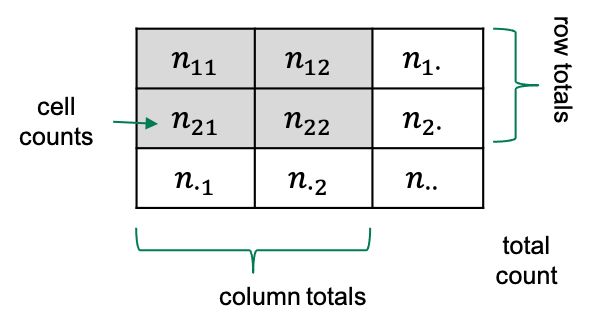

:::::::::::::::::::::::::::::::::::::: questions 

- What is categorical data and how is it usually represented?

::::::::::::::::::::::::::::::::::::::::::::::::

::::::::::::::::::::::::::::::::::::: objectives

- Introduce the contingency table.
- Learn to set up a contingency table in R.

::::::::::::::::::::::::::::::::::::::::::::::::

## Introduction

In biological experiments, we often compare what categories observations fall into. For example, we might look at cells in microscopy images and categorize them by the cell cycle, or by whether they carry a certain marker.
We could categorize individuals (animals of humans) by whether they received a treatment in an experimental set-up, or by sex.

In this lesson, you'll learn

- how to handle data sets containing categorical data in R,  
- how to visualize categorical data,  
- how to calculate effect sizes, 
- how to test for a difference in proportions, and 
- what to watch out for when applying these methods to biological data.

## Contingency tables

Let's start by looking at how categorical data is usually presented to us.  
The most common format to communicate categorical data is by using a *contingency table*. 
The following example describes an experiment that aims at finding out whether exposure to a chemical in question increases the risk of getting a certain disease. In the experiment, 200 mice were either exposed to the chemical (N=100) or not (N=100). After 4 weeks, the mice were tested for whether they had developed the disease. In the non-exposed group, 4 mice had the disease, and within the exposed group, 10 mice developed teh disease. This information can be displayed as follows:

```{r echo = FALSE}
mytable <- rbind(c(4,96), c(10,90))
rownames(mytable) <- c("non-exposed","exposed")
colnames(mytable) <- c("diseased", "healthy")
knitr::kable(mytable, align="cc")
```


Each mouse either was either exposed, or not. So `exposure` is a categorical variable with two levels, `exposed` and `non_exposed`.
Similarly, we have a variable which we might call `outcome`, with the categories `healthy` and `diseased`. 

The above contingency is a so-called 2x2 table, because it has two rows and two columns. There are also variables with more than two categories, which lead to larger tables.

In a contingency table, the rows and columns specify which categories the two variables can take. The cells of the table represent the possible combinations of the variable (for example `healthy` and `exposed` is a possible combination), and the cell gives the count how many times this combination was observed in the study or experiment at hand. 

## Some terminology

If we have a 2x2 table, then there are four squares with numbers in them, which we refer to as the **cells** of the table.  
Each cell contains a **count**, which we call $n$, and we index it by the rows and columns of that table. So the count in row 1 and column 2 will be called $n_{12}$.  
Sometimes we also look at row totals or column totals, and in this lesson we use a dot ($\cdot$) to indicate when a row or column is summed over). The total counts in row 2, for example would be referred to as $n_{2\cdot}$. 

{width="300px"}

```{r echo = FALSE, include=FALSE}
mytable <- rbind(c("n11","n12"), c("n21","n22"))
rownames(mytable) <- c("non-exposed","exposed")
colnames(mytable) <- c("diseased", "healthy")
knitr::kable(mytable, align="cc")
```

## Contingency tables in R

Let's suppose you have some observations, and you want to code them up in a contingency table in R. For most of the analysis that we'll see in this lesson, it's most useful to store the data in a matrix.

One way of constructing a matrix is by using the function `rbind`, which "binds rows": It takes vectors as arguments, and stacks them as the rows of a matrix. 

For the above table, the function call looks like this:
```{r use-rbind}
mytable <- rbind(
  c(4,96),
  c(10,90)
)
mytable
```

Now, to remember which cell represents which observations, I find it useful to name the rows and columns:
```{r}
rownames(mytable) <- c("non-exposed","exposed")
colnames(mytable) <- c("diseased", "healthy")
mytable
```

Later in this lesson, we'll also see how to tabulate observations from data frames, and how to turn contingency tables into a tidy format for modeling. But first, let's get started with analyzing the table.
