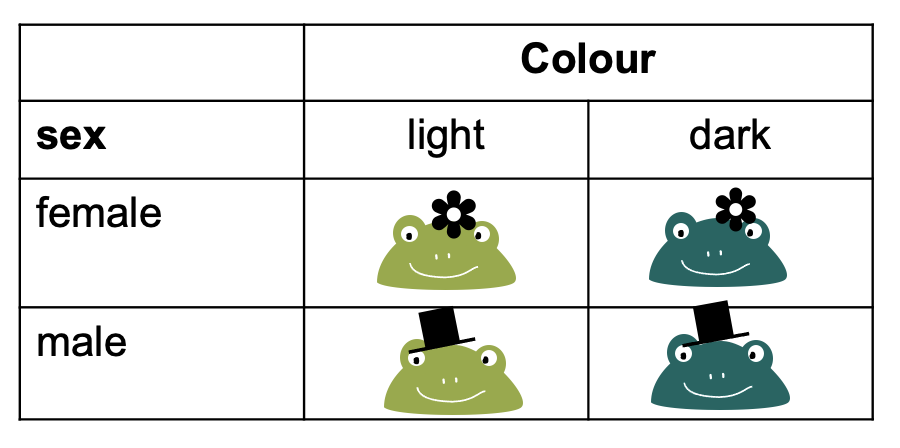
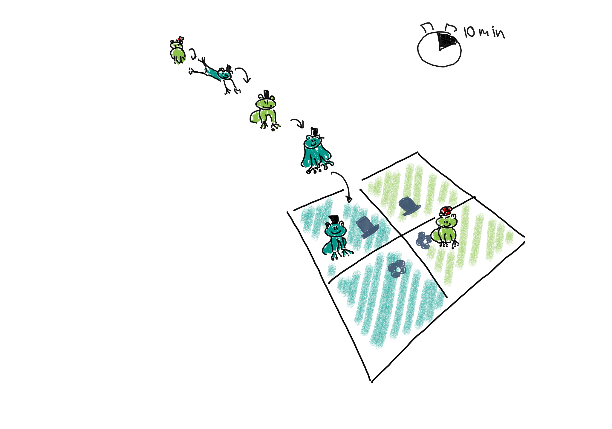
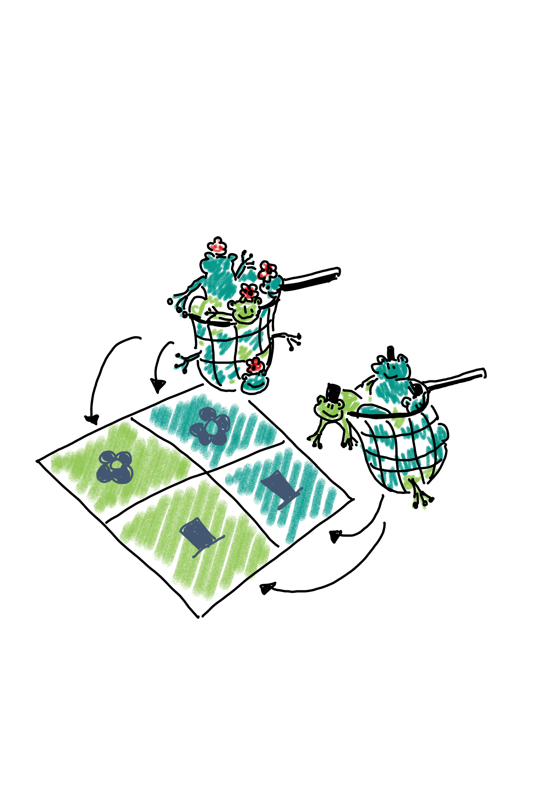
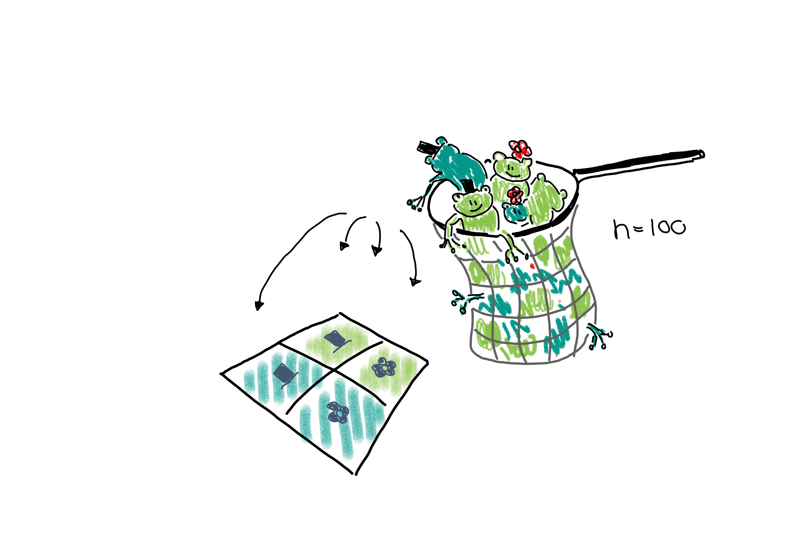

:::::::::::::::::::::::::::::::::::::: questions 
- Question 1
::::::::::::::::::::::::::::::::::::::::::::::::

::::::::::::::::::::::::::::::::::::: objectives
- Understand the how counts are generated.
::::::::::::::::::::::::::::::::::::::::::::::::

Where do the counts in the contingency table come from? Answering this question is an important part of understanding how we expect them to behave in scenarios where two variables are independent or associated.

Let's switch to a different toy example: We have a contingency table with frogs, which can either be male or female, and they can be either light or dark green. 

{width="400px" alt="contingency table with images of male/female and light/dark frogs"}

To fill this table with counts, we can imagine different study designs that correspond to different sampling schemes. 

## Sampling schemes

**1. Poisson sampling:**
Frogs of both sexes and colors could be collected for a fixed period of time, let's say 10 minutes. They are then sorted into the four categories (male-light, male-dark, female-light, and female-dark).

{width="500px" alt="binomial sampling scheme with frogs"}

We could describe this process as Poisson sampling, where each category has its own Poisson rate $\lambda_{r,c}$. We also know that the Poisson distribution is an approximation of binomial distribution, with a rate of

$$\lambda_{r,c} = n * p_{r,c},$$

where in this example, $n$ is the number of frogs we usually see during the 10 min, and $p_{r,c}$ is the *success probability* of a frog belonging to the respective category. The rate $\lambda_{rc}$ is the expected count for the cell in row $r$ and column $c$.

**2. Binomial sampling:**
Maybe there are many more female than male frogs in the lake, and therefore the researchers decided to balance the study by catching 50 male and 50 female frogs, and comparing the proportions or light and dark between those.

{width="400px"}

In this case, we could describe the scenario as two binomial sampling processes. 
In one of them, we have  

- a fixed number of $n_{1\cdot}$ female frogs, and a probability of $p_{xx}$ for each of them of being light. 
- a fixed number of $n_{2\cdot}$ male frogs, and a probability of $p_{x}$ for each of them of being light.

The expected count for each cell is $p_{xx}n_{1\cdot}$.

**Multinomial sampling:**
One could also set up a study in which the total number of frogs is fixed from the beginning, for example the researchers could fill a net with 100 frogs and then sort them into the four categories.

{width="500px"}

This would be described as a multinomial sampling. There is a fixed number of $n_{\cdot,\cdot}$ frogs (=events), and there are four different outcomes for each event, each with its own probability $p_{r,c}$. The expected count in each cell is thus $n_{\cdot\cdot}p_{rc}$.  

:::::::::::::: callout

If the terms I'm using above sound unfamiliar to you, please revisit the [lesson on statistical distributions](https://sarahkaspar.github.io/biostatistics-course/).

:::::::::::::::::

## Expected counts

You probably noticed that, irrespective of the sampling scheme, i.e. *the data generating process*, the expected count for each cell is some multiplication of a probability $p$ and a number of observations $n$. 
If we collect data, we can control the sampling scheme, but, of course, we don't know the true $p$s. If we knew them, we could answer right away whether the proportions of dark frogs are different among female and male frogs. 

However, we can make a prediction about how we expect the probabilities -- and thus counts -- to behave in case the proportions of dark frogs are the same for both sexes. For this, we need an excursion to probability theory.

## Probability rule for independence

When we are asking whether the proportions of dark frogs are the same for both sexes, we can rephrase this question and ask: Are the sex and the color independent of each other.

Let's look at two examples, one for independent and one for dependent probabilities.

As an example for **independent events**, consider two coins that are being flipped. If no black magic is at work, then the outcome of the first coin flip shouldn't influence the outcome of the second. The probability of seeing two times head up is therefore

$$P(\text{head},\text{head}) = \overbrace{P(\text{head})}^{\text{first coin}} \cdot \overbrace{ P(\text{head})}^{\text{second coin}} = \frac{1}{2} \cdot \frac{1}{2} = \frac{1}{4} $$

More generally, we can say that if two events $A$ and $B$ are independent, then the probability of them occuring together is 

$$P(A,B) = P(A) \cdot P(B)$$

This probability rule doesn't hold when two outcomes are **associated** with each other. 
For example, we know that hair and eye color are associated. The probability of having blond hair and blue eyes can *not* be calculated by multiplying the individual probabilities. Why? Because once we know that someone has blond hair, the probability of also observing blue eyes is much higher than the *marginal* probability of having blue eyes. The marginal probability is the probability of having blue eyes, averaged over all people of all hair colors. We'd have to calculate 

$$P(\text{blond},\text{blue}) = P(\text{blond}) \cdot \overbrace{P(\text{blue|blond})}^{\text{conditional probability}},$$
where $P(\text{blond})$ is the overall (marginal) probability of having blond hair, and $P(\text{blue|blond})$ is the *conditional probability* of having blue eyes, for those that have blond hair.

The important part for us to move on with the contingency table analysis is that, when two events or variables $A$ and $B$ are associated, then 

$$P(A,B) \neq P(A) \cdot P(B).$$

