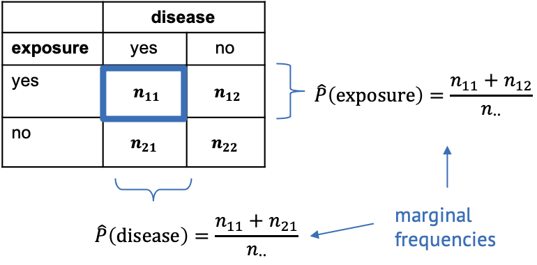
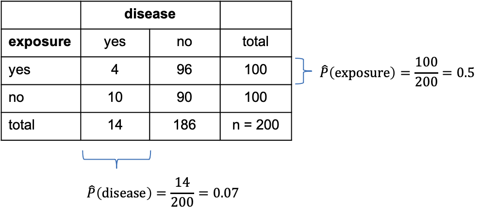

:::::::::::::::::::::::::::::::::::::: questions 
- What are the null and alternative hypothesis of the chi-square test? 
- What are the expected counts under the null hypothesis?
- What is the test statistic for the chi-square test?
- How can I run the chi-square test in R?
::::::::::::::::::::::::::::::::::::::::::::::::

::::::::::::::::::::::::::::::::::::: objectives
- Understand the principle behind the chisquare test.
- Be able to apply the chisquare test in R.
::::::::::::::::::::::::::::::::::::::::::::::::

## A hypothesis test for independence

So far, we have learned that 

- in a $2\times 2$ contingency table, we tabulate the counts according to two variables. 
- We are usually interested in whether the two variables are associated.
- If the variables are associated, they should not follow the probability rules for independence. 

If we'd like to set up a hypothesis test for whether the two varilables are associated, then we have to formulate a null hypothesis, and then calculate the probability of the observed counts under this hypothesis.

Let's start with the null and alternative hypothesis.
The **null hypothesis** is that the two variables are **independent**.  
If we can reject the null hypothesis, we will take on the **alternative hypothesis** is that the two variables are **associated**.  

## Expected counts under then null hypothesis
In the chi-square test, which tests the above hypothesis, we start by calculating the expected counts under the null hypothesis, and then check how far the actual data are away from the expectation.  

For this, we need to calculate the *marginal frequencies* of the outcomes of each variable. Remember, the marginal frequencies could also be translated as the *overall* frequency of this outcome. 

{width="600px"}

The marginal frequencies are our estimate for the true *marginal probabilities*, which is why they are noted as $\hat{P}$ (p hat). Remember that the hat indicates that the quantity below the hat is an estimate. 

In the exposure/disease example, we can calculate the estimate for the marginal disease probability as 

$$\hat{P}(\text{disease}) = \frac{n_{11}+n_{21}}{n_{\cdot\cdot}}.$$

This means we take the total number of diseased mice in the experiment (those that have been exposed, and those that haven't been) and divide it by the total number of mice in the experiment. In other words, we calculate the proportion of mice with disease, ignoring that some of them have been exposed to the chemical and others haven't. 

Likewise we can calculate the marginal proportion of exposed mice as 

$$\hat{P}(\text{exposed}) = \frac{n_{11} + n_{12}}{n_{\cdot\cdot}},$$
meaning we divide the number of all exposed mice (ignoring whether they contracted the disease) by the total number of mice in the experiment.

Let's add some numbers to this:

{width="500px"}

In the above table, I've added the marginal totals on the sides (I think that's where the term "marginal" comes from). We see that, in total, 100 out of the 200 mice were exposed to the chemical (by design of the experiment), which gives a marginal proportion of 
$$\hat{P}(\text{exposure})=\frac{100}{200}=0.5$$ 
of exposed mice.
On the other hand, ignoring exposure, 14 out the 200 mice caught the disease during the experiment, giving an estimated marginal probability of

$$\hat{P}(\text{disease})=\frac{14}{200}=0.07.$$

Now, the key point is that we estimated the probabilities of exposure and disease, while *ignoring* the respective other variable -- which is exactly what's valid to do when the two variables are not associated. 
So, assuming the null hypothesis is true and the variables are in fact nor associated, we can use these estimated probabilities and apply the probability rule for independence to calculate the estimated counts under the null. 

For example, the expected count for exposed, diseased mice is

$$E(n_{11}) = \hat{P}(\text{exposed}) \cdot \hat{P}(\text{disease}) \cdot n_{\cdot\cdot} = 0.5 \cdot 0.07 \cdot 200 = 7.$$


:::::::::::::::::: challenge

Can you calculate the expected count for non-exposed diseased mice under the assumption of independence?

:::::::::::::::::::: solution
$$E_{22} = \hat{P}(\text{non-exposed}) \cdot \hat{P}(\text{healthy}) \cdot n_{\cdot\cdot} = 0.5 \cdot 0.93 \cdot 200 = 93$$
:::::::::::::::::::::::::::::
:::::::::::::::::::::::::::

## The Chi-square statistic

If we have expected counts under the assumption of independence, the natural thing to do is compare them with the **actual** counts. 
For a hypothesis test, we'd like to have the probability of the observed counts under the assumption of independence, which is one value, while we have four counts. Therefore, in the chi-square test, the discrepancy between observed and expected counts is summarized into one *statistic* called $\chi^2$ (chi square):

$$\chi^2 = \sum_{ij}\frac{(O_{ij}-E_{ij})^2}{E_{ij}}$$

where

- $i$ and $j$ are the row and column indices,
- $O$ is the observed count, and
- $E$ is the expected count.

The value $\chi^2$ is the sum of squares of the differences between observed and expected counts, normalized by the expected counts, and it **quantifies the deviation from independence**. 

Now we need the probability of the $\chi^2$ calculated from our data under the assumption of independence. 
To find a **null distribution** for $\chi^2$, you could repeatedly simulate data from a model in which the two variables are independent, and then compare the observed value to the resulting distribution. 
Since in the previous lessons, we haven't yet learned how to do this, we'll stick with textbook knowledge for now:  

The textbook tells us that the *test statistic* $\chi^2$ follows a so-called $\chi^2$ distribution (just like the t-statistic follows a t-distribution) with $(r-1)\cdot(r-2)$ degrees of freedom, where $r$ and $c$ are the numbers of rows and columns in the contingency table, respectively.

## The Chi-square test in R

Let's look at some results in practice. The test itself is really just one line of code. 

```{r setup-chisquare-test, echo=FALSE}
mytable <- rbind(
  c(4,96),
  c(10,90)
)
rownames(mytable) <- c("non-exposed","exposed")
colnames(mytable) <- c("diseased", "healthy")
```

```{r}
chisq.test(mytable, correct=FALSE)
```

The output is also rather compact. We learn that R has calculated a value for $\chi^2=2.765$.  
`df=1` tells us that it has compared this value to a $\chi^2$-distribution with one degree of freedom. 
`p-value = 0.09635` means that the probability of observing a $\chi^2\geq 2.765$ is around 10%. 

We could also perform this calculation ourselves: 
```{r}
pchisq(2.765,df=1, lower.tail=FALSE)
```

**Conclusion:** The difference in proportions of diseased mice are not significantly different in the exposure and no-exposure groups. 

As a reminder: This doesn't mean that exposure and disease are not associated, but that the data doesn't hold enough evidence for a potential association, at a significance level of $\alpha=0.05$. 

:::::::::::::::::: discussion
Look into the help for the `chisq.test` function. Why is there no option to choose between a one-sided and a two-sided test?
:::::::::::::::::::::::::::::

:::::::::::::::::::: callout
# Note
In the function call to `chisq.test`, we used the argument `correct=FALSE`. This argument determines whether or not *Yates continuity correction* is used. If you want to learn more about it, have a look [here](https://en.wikipedia.org/wiki/Yates%27s_correction_for_continuity). My suggested default is to not use it. 
::::::::::::::::::::::::::::
 
::::::::::::::::::::::::::::: challenge

Assign the output of the `chisq.test` function call to a variable, and apply the `names` function on it. Can you look at the expected counts for the exposure/disease table?

::::::::::::::::::::: solution
```{r}
mytest <- chisq.test(mytable, correct =FALSE)
names(mytest)
mytest$expected
```

::::::::::::::::::::::::::::
::::::::::::::::::::::::::::::::::

## When to apply

The $\chi^2$ test is applicable to 2-dimensional contingency tables for testing the hypothesis of independence.

- It assumes that all observations are independent (one observation is an event that leads to the count in one cell being increased by 1). 
- A rule of thumb is that the expected values of all cells in the contingency table should be >5 in at least 80% of the cells, and the expected cells should not be <1 in any of the cells. If this isn't the case, an alternative is Fisher's exact test (see [next episode](../06-power.Rmd)). 


